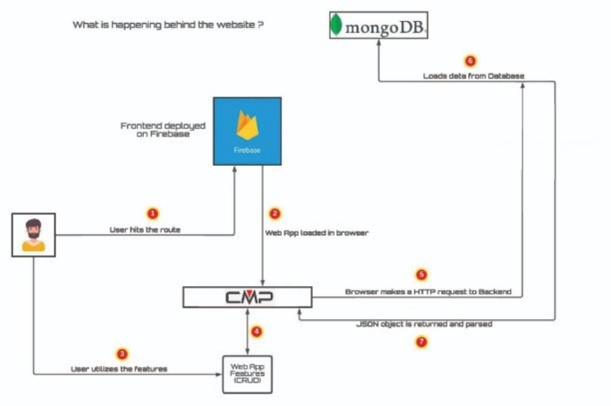

<h1 align = "center"> Complaint Management Portal </h1>
<h2> Architecture Design </h2>
<h4> Entity-Relationship Diagram </h4>

<h4> Login Architecture</h4>

<h4> Website Structure </h4>

<h2> Technologies Used </h2>
<ul>
  <li> NodeJS - Event I/O for backend </li>
  <li> Express - Fast node.js network app framework </li>
  <li> MongoDB - NoSQL Database </li>
  <li> React.js - Javascript library to build user frameworks. </li>
  <li> GoogleOAuth - Open Authorization from Google </li>
  <li> Bootstrap - CSS framework for responsive frontend </li>
</ul>
